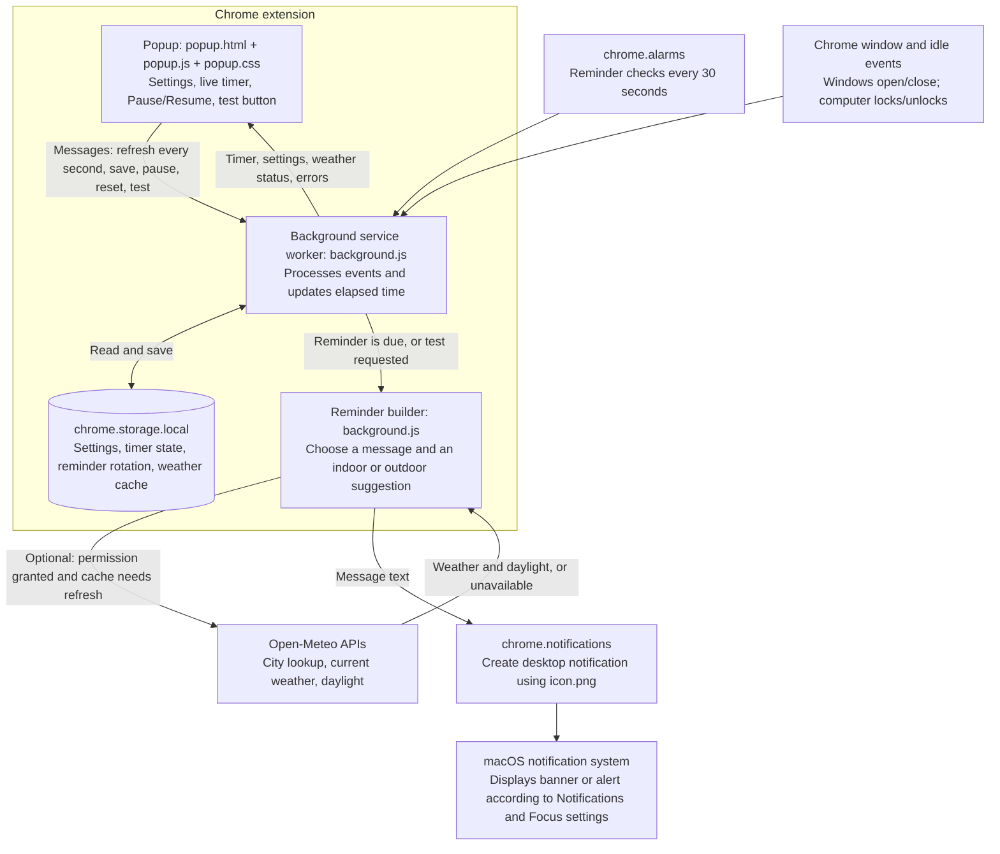

# Take a Break Reminder

A small Chrome Extension that tracks time with Chrome windows open and reminds you to take a break after a customizable amount of time.

## Architecture



The diagram renders in Markdown viewers that support Mermaid, including GitHub.

1. **Count time:** The background worker counts elapsed time while any Chrome browser window is open, unless manually paused or the computer is locked. Chrome alarms keep reminder checks running when the popup is closed; opening the popup adds checks every second.
2. **Build the reminder:** When the configured interval is reached and automatic notifications are enabled, the worker rotates the message. Optional weather checks suggest a walk only in suitable daylight conditions; missing or unsuitable weather produces an indoor suggestion.
3. **Deliver and save:** The worker asks Chrome to create the notification. On success, it resets the timer and advances the message rotation. On failure, it preserves elapsed time and shows the error in the popup. Test notifications preview a message without resetting, resuming, or advancing the timer's rotation.

The worker processes events one at a time to avoid overlapping storage updates. Settings, manual pause, and accumulated time live in local storage, so they survive closing the popup and restarting the worker. Only optional weather lookups contact an external service.

## Install locally

Requires Google Chrome 120 or newer. No build step or API key is needed.

Download this repository using **Code > Download ZIP** on GitHub and extract it, or clone it with Git.

1. Open `chrome://extensions`.
2. Turn on **Developer mode**.
3. Click **Load unpacked**.
4. Select the extracted or cloned project folder containing `manifest.json`.
5. Open the extension popup, choose your interval and city, and click **Save settings**. Weather access is optional; uncheck **Weather-aware walk suggestions** to use it without weather.

## Customize

Click the extension icon in Chrome to set:

- how many minutes with Chrome open should trigger a reminder
- whether desktop notifications are enabled
- whether reminders use the weather to suggest a walk, and which city to check

The timer counts whenever at least one Chrome browser window is open, including unfocused or minimized windows on any display. Multiple windows count as one timer. Mouse and keyboard inactivity does not pause it. It stops when all Chrome windows are closed or your computer is locked.
Use **Pause timer** to stop counting and reminders without losing elapsed time. Use **Resume timer** to continue. Your pause choice is saved when the popup closes or Chrome restarts.
After each reminder, the timer resets automatically for the next interval. Breaks are not timed.

After updating these files, click **Reload** on this extension in `chrome://extensions`, then reopen its popup.

## Reminder variations and weather

Reminders rotate through friendly suggestions to stretch, get water, rest your eyes, or move around.

To enable weather suggestions:

1. Reload the extension at `chrome://extensions` and open its popup.
2. Leave **Weather-aware walk suggestions** checked. **Weather city** defaults to **Chicago**; change it when needed.
3. Click **Save settings** and allow access to the two Open-Meteo weather service addresses when Chrome asks.
4. Check the resolved weather location shown beneath the city field. For an ambiguous city, include its state or country in the city field and save again.
5. Click **Test notification** to preview a reminder with the current weather. The test does not reset or resume your timer.

A walk is suggested only during daylight, with no precipitation, clear-to-overcast conditions, a feels-like temperature of 10-28 C (50-82 F), wind at most 25 km/h (16 mph), and gusts at most 35 km/h (22 mph). These are simple comfort checks, not a safety assessment or an air-quality check. At night or in unsuitable weather, the reminder suggests an indoor break.

Weather data is refreshed as needed for reminders and cached for 10 minutes. If the service is offline, times out, has stale data, or has no permission, regular break reminders still work. Turn off **Weather-aware walk suggestions** and save to stop weather requests.

Weather and daylight data: [Open-Meteo](https://open-meteo.com/en/docs). City lookup data: [Open-Meteo / GeoNames](https://open-meteo.com/en/docs/geocoding-api). Weather checks send your chosen city and its coordinates to these services; the extension does not use GPS or send your browsing history.

## Check notifications

Click **Test notification** to send an immediate test without resetting or resuming your timer. This works even when automatic reminders are disabled.

### No banner? Check macOS notification settings

Labels may vary slightly by macOS version.

1. Open the **Apple menu > System Settings > Notifications**.
2. Find and click **Google Chrome**.
3. Turn on **Allow notifications**.
4. Choose **Banners** or **Alerts**, rather than **None**. On newer versions, enable **Desktop** notifications and select **Temporary** or **Persistent**.
5. If **Google Chrome Helper (Alerts)** also appears in the app list, repeat these settings for it.
6. If you are mirroring or sharing your display, enable **Allow notifications when mirroring or sharing the display**. On versions with a menu for this setting, choose **Allow Notifications**.

See [Apple's notification settings guide](https://support.apple.com/guide/mac-help/change-notifications-settings-mh40583/mac).

### Check Focus and Do Not Disturb

1. Open **Control Center** in the top-right menu bar.
2. Click **Focus** and turn off any active mode, including **Do Not Disturb**, while testing.
3. To keep Focus enabled while receiving reminders, open **System Settings > Focus** and select the Focus mode you use.
4. Open **Allowed Apps** and add **Google Chrome**. Add **Google Chrome Helper (Alerts)** too if it is available. If your version offers a choice between allowing and silencing selected apps, choose **Allow Notifications From**.
5. Reopen the extension popup and click **Test notification** again.

See [Apple's Focus settings guide](https://support.apple.com/guide/mac-help/change-focus-settings-mchlff5da36d/mac).

### Automatic reminders

Keep **Show desktop notifications** enabled and click **Save settings** for automatic reminders. Any errors reported by Chrome appear in the popup, and a failed reminder does not reset the timer.
The popup checks reminders every second while open. With the popup closed, Chrome checks every 30 seconds; the browser may delay alarms further.

## Development checks

The automated tests use Node.js 20 or newer and require no dependencies:

```sh
node --check background.js
node --check popup.js
node --test tests/notifications.test.js tests/popup.test.js
```

The tests simulate Chrome APIs. They do not verify real desktop banners, Chrome's window and lock events, or extension permission prompts. Before sharing a release, load the extension in Chrome, check the test notification, try a one-minute interval with the popup closed, and verify Pause/Resume and weather access.
